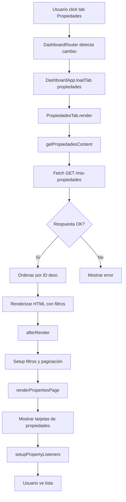
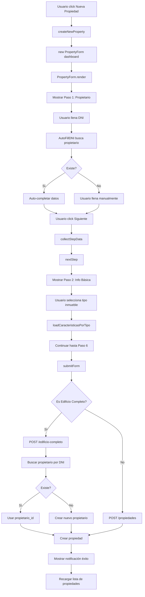
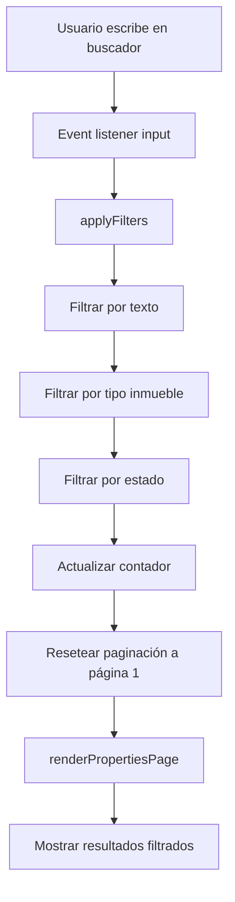

# 🏠 ARQUITECTURA TAB PROPIEDADES - ANÁLISIS COMPLETO

**Fecha:** 13 de Noviembre 2025  
**Versión:** 1.0  
**Estado:** ✅ Producción

---

## 📋 ÍNDICE

1. [Flujo General](#flujo-general)
2. [Archivos JavaScript Involucrados](#archivos-javascript-involucrados)
3. [Clases y Métodos](#clases-y-métodos)
4. [Diagrama de Flujo](#diagrama-de-flujo)
5. [Endpoints API](#endpoints-api)
6. [Dependencias](#dependencias)

---

## 🎯 FLUJO GENERAL

### Escenario: Usuario accede a la pestaña "Propiedades"

```
1. Usuario hace click en tab "Propiedades" (dashboard.html)
   ↓
2. DashboardRouter detecta cambio de tab
   ↓
3. DashboardApp carga PropiedadesTab
   ↓
4. PropiedadesTab.render() obtiene propiedades del usuario
   ↓
5. Se renderiza lista con filtros, paginación y acciones
   ↓
6. Usuario puede: Ver, Editar, Eliminar, Crear nueva propiedad
```

---

## 📁 ARCHIVOS JAVASCRIPT INVOLUCRADOS

### 1️⃣ **HTML Base**
```
📄 dashboard.html (líneas 128-145)
├── Contenedor de tabs dinámicos
├── Área de contenido (#tabContent)
└── Carga todos los scripts necesarios
```

### 2️⃣ **Core de Dashboard (Orquestación)**

| Archivo | Líneas | Responsabilidad |
|---------|--------|-----------------|
| `js/pages/dashboard/core/dashboard-app.js` | ~200 | Aplicación principal, gestiona tabs y navegación |
| `js/pages/dashboard/core/dashboard-router.js` | ~150 | Routing entre tabs, manejo de URL hash |
| `js/pages/dashboard/config/tabs-config.js` | ~100 | Configuración de tabs por perfil de usuario |

### 3️⃣ **Tab Propiedades (Módulo Principal)**

```javascript
📄 js/pages/dashboard/tabs/propiedades/propiedades.js (1,347 líneas)
```

**Clase:** `PropiedadesTab`

#### Métodos Principales:

| Método | Líneas | Funcionalidad |
|--------|--------|---------------|
| `constructor(app)` | 9-12 | Inicializa tab con referencia a app principal |
| `render()` | 17-24 | Punto de entrada, renderiza contenido del tab |
| `getPropiedadesContent()` | 29-123 | Obtiene propiedades del backend y genera HTML |
| `afterRender()` | 128-152 | Lifecycle hook: setup después de renderizar |
| `renderPropertiesPage()` | 158-171 | Renderiza página actual con paginación |
| `setupPropertyListeners()` | 176-268 | Event listeners para botones (Nueva, Editar, Eliminar) |
| `renderPropertyCard(prop)` | 273-445 | Genera HTML de una tarjeta de propiedad |
| `getPropertyImage(prop)` | 450-470 | Obtiene URL de imagen principal o placeholder |
| `formatPrice(precio, moneda)` | 475-485 | Formatea precio con símbolo de moneda |
| `formatDate(dateString)` | 490-500 | Formatea fecha a formato legible |
| `getStatusBadge(estado)` | 505-530 | Genera badge HTML según estado de propiedad |
| `applyFilters()` | 535-620 | Aplica filtros de búsqueda y tipo |
| `deleteProperty(propId)` | 625-690 | Elimina propiedad con confirmación |
| `editProperty(propId)` | 695-720 | Abre formulario de edición |
| `createNewProperty()` | 725-745 | Abre formulario para nueva propiedad |
| `getErrorContent(error)` | 750-770 | Muestra mensaje de error |

### 4️⃣ **Componentes de Soporte**

#### **Filtros**
```javascript
📄 js/pages/dashboard/filters.js (~400 líneas)
```

**Clase:** `Filters`

| Método | Funcionalidad |
|--------|---------------|
| `render()` | Genera HTML de filtros (búsqueda, tipo, estado) |
| `setup()` | Inicializa combos y event listeners |
| `setActiveTab(tab)` | Registra tab activo para aplicar filtros |
| `loadTiposInmueble()` | Carga tipos de inmueble desde API |

#### **Paginación**
```javascript
📄 js/pages/dashboard/pagination.js (~300 líneas)
```

**Clase:** `Pagination`

| Método | Funcionalidad |
|--------|---------------|
| `render(items, currentPage)` | Genera HTML del paginador |
| `setActiveTab(tab)` | Registra tab activo para paginar |
| `updateItemsPerPage()` | Calcula items por página según viewport |
| `goToPage(page)` | Navega a página específica |

#### **Carrusel de Imágenes**
```javascript
📄 js/pages/dashboard/carousel.js (~200 líneas)
```

**Clase:** `Carousel`

| Método | Funcionalidad |
|--------|---------------|
| `show(images, startIndex)` | Muestra modal con carrusel de imágenes |
| `next()` | Navega a siguiente imagen |
| `prev()` | Navega a imagen anterior |
| `close()` | Cierra modal |

#### **Favoritos Handler**
```javascript
📄 js/pages/dashboard/favorites-handler.js (~250 líneas)
```

**Clase:** `FavoritesHandler`

| Método | Funcionalidad |
|--------|---------------|
| `init()` | Inicializa event listeners para botones de favoritos |
| `toggleFavorite(propId)` | Agrega/quita de favoritos |
| `updateUI(propId, isFavorite)` | Actualiza estado visual del botón |

### 5️⃣ **Formulario de Propiedades**

```javascript
📄 js/pages/dashboard/property-form.js (4,359 líneas)
```

**Clase:** `PropertyForm`

#### Métodos Principales:

| Método | Líneas | Funcionalidad |
|--------|--------|---------------|
| `constructor(dashboard, propId)` | 1-50 | Inicializa formulario (nuevo o editar) |
| `render()` | 960-1000 | Renderiza formulario completo (6 pasos) |
| `renderHeader()` | 1005-1050 | Header con título y botón cerrar |
| `renderProgressBar()` | 1055-1200 | Barra de progreso con iconos |
| `renderStep1()` | 1254-1270 | Paso 1: Información del Propietario |
| `renderStep2()` | 1280-1370 | Paso 2: Información Básica del Inmueble |
| `renderStep3()` | 1380-1422 | Paso 3: Características del Inmueble |
| `renderStep4()` | 1467-1650 | Paso 4: Configurar Oficinas (Edificio Completo) |
| `renderStep5()` | 1655-1720 | Paso 5: Transacción y Precio |
| `renderStep6()` | 1724-1795 | Paso 6: Imágenes de la Propiedad |
| `renderCaracteristicasAcordeon()` | 1800-1887 | Acordeón de características dinámicas |
| `loadCaracteristicasPorTipo(tipoId)` | 135-177 | Carga características según tipo de inmueble |
| `loadPropertyData()` | 196-475 | Carga datos de propiedad para editar |
| `populateFormFields()` | 800-950 | Pre-llena campos en modo editar |
| `collectStepData()` | 2299-2490 | Recolecta datos del paso actual |
| `nextStep()` | 2493-2550 | Avanza al siguiente paso |
| `previousStep()` | 2552-2560 | Retrocede al paso anterior |
| `submitForm()` | 2562-2850 | Envía formulario al backend |
| `prepareEdificioCompletoData()` | 3963-4100 | Prepara payload para edificio completo |

### 6️⃣ **Servicios (API)**

#### **Properties Service**
```javascript
📄 js/services/properties.service.js (~400 líneas)
```

| Método | Endpoint | Funcionalidad |
|--------|----------|---------------|
| `getMisProperties()` | `GET /propiedades/mis-propiedades` | Obtiene propiedades del usuario |
| `getPropertyById(id)` | `GET /propiedades/{id}` | Obtiene detalle de propiedad |
| `createProperty(data)` | `POST /propiedades` | Crea nueva propiedad |
| `updateProperty(id, data)` | `PUT /propiedades/actualizar-completa/{id}` | Actualiza propiedad |
| `deleteProperty(id)` | `DELETE /propiedades/{id}` | Elimina propiedad |

#### **Propietario Service**
```javascript
📄 js/services/propietario.service.js (~192 líneas)
```

| Método | Endpoint | Funcionalidad |
|--------|----------|---------------|
| `buscarPorDNI(dni)` | `GET /propietarios/{dni}` | Busca propietario por DNI |
| `crear(data)` | `POST /propietarios` | Crea nuevo propietario |
| `actualizar(id, data)` | `PUT /propietarios/{id}` | Actualiza propietario |

#### **Edificio Service**
```javascript
📄 js/services/edificio.service.js (~300 líneas)
```

| Método | Endpoint | Funcionalidad |
|--------|----------|---------------|
| `crearEdificioCompleto(data)` | `POST /propiedades/edificio-completo` | Crea edificio con oficinas |
| `actualizarEdificioCompleto(id, data)` | `PUT /propiedades/edificio-completo/{id}` | Actualiza edificio |
| `getOficinasEdificio(id)` | `GET /propiedades/edificio/{id}/oficinas` | Obtiene oficinas de edificio |

#### **Auth Service**
```javascript
📄 js/services/auth.service.js (~500 líneas)
```

| Método | Funcionalidad |
|--------|---------------|
| `getToken()` | Obtiene token JWT de localStorage |
| `getCurrentUser()` | Obtiene datos del usuario actual |
| `isAuthenticated()` | Verifica si usuario está autenticado |

### 7️⃣ **Componentes Auxiliares**

#### **Auto-fill DNI**
```javascript
📄 js/components/propietario/auto-fill-dni.js (~150 líneas)
```

**Clase:** `AutoFillDNI`

| Método | Funcionalidad |
|--------|---------------|
| `init()` | Inicializa listener en campo DNI |
| `buscarPropietario(dni)` | Busca y auto-completa datos del propietario |

#### **Selector Edificio**
```javascript
📄 js/components/edificio/selector-edificio.js (~200 líneas)
```

**Clase:** `SelectorEdificio`

| Método | Funcionalidad |
|--------|---------------|
| `render()` | Muestra combo de edificios disponibles |
| `getEdificioId()` | Retorna ID del edificio seleccionado |

#### **Modal Masivo**
```javascript
📄 js/components/edificio/modal-masivo.js (~300 líneas)
```

**Clase:** `ModalMasivo`

| Método | Funcionalidad |
|--------|---------------|
| `show()` | Muestra modal para registro masivo de oficinas |
| `aplicarEquipamiento()` | Aplica equipamiento a oficinas seleccionadas |

---

## 🔄 DIAGRAMA DE FLUJO DETALLADO

### **Flujo 1: Listar Propiedades**



### **Flujo 2: Crear Nueva Propiedad**



### **Flujo 3: Editar Propiedad**

```mermaid
graph TD
    A[Usuario click Editar] --> B[editProperty propId]
    B --> C[new PropertyForm dashboard, propId]
    C --> D[loadPropertyData]
    D --> E[Fetch GET /propiedades/{id}]
    E --> F[populateFormFields]
    F --> G[Pre-llenar todos los campos]
    G --> H[Usuario modifica datos]
    H --> I[submitForm en modo editar]
    I --> J{Es Edificio Completo?}
    J -->|Sí| K[PUT /edificio-completo/{id}]
    J -->|No| L[PUT /actualizar-completa/{id}]
    K --> M[Actualizar propiedad]
    L --> M
    M --> N[Mostrar notificación éxito]
    N --> O[Recargar lista]
```

### **Flujo 4: Eliminar Propiedad**

```mermaid
graph TD
    A[Usuario click Eliminar] --> B[deleteProperty propId]
    B --> C[SweetAlert confirmación]
    C --> D{Confirma?}
    D -->|No| E[Cancelar]
    D -->|Sí| F[Fetch DELETE /propiedades/{id}]
    F --> G{Respuesta OK?}
    G -->|Sí| H[Eliminar de allProperties]
    G -->|No| I[Mostrar error]
    H --> J[Recargar página actual]
    J --> K[Mostrar notificación éxito]
```

### **Flujo 5: Aplicar Filtros**



---

## 🌐 ENDPOINTS API UTILIZADOS

### **Propiedades**

| Método | Endpoint | Descripción | Usado en |
|--------|----------|-------------|----------|
| GET | `/propiedades/mis-propiedades` | Lista propiedades del usuario | `getPropiedadesContent()` |
| GET | `/propiedades/{id}` | Detalle de propiedad | `loadPropertyData()` |
| POST | `/propiedades` | Crear propiedad simple | `submitForm()` |
| POST | `/propiedades/edificio-completo` | Crear edificio completo | `submitForm()` |
| PUT | `/propiedades/actualizar-completa/{id}` | Actualizar propiedad | `submitForm()` |
| PUT | `/propiedades/edificio-completo/{id}` | Actualizar edificio completo | `submitForm()` |
| DELETE | `/propiedades/{id}` | Eliminar propiedad | `deleteProperty()` |

### **Propietarios**

| Método | Endpoint | Descripción | Usado en |
|--------|----------|-------------|----------|
| GET | `/propietarios/{dni}` | Buscar por DNI | `buscarPorDNI()` |
| POST | `/propietarios` | Crear propietario | `submitForm()` |

### **Características**

| Método | Endpoint | Descripción | Usado en |
|--------|----------|-------------|----------|
| GET | `/caracteristicas-x-inmueble/tipo-inmueble/{id}/agrupadas` | Características por tipo | `loadCaracteristicasPorTipo()` |

### **Tipos de Inmueble**

| Método | Endpoint | Descripción | Usado en |
|--------|----------|-------------|----------|
| GET | `/tipo-inmueble` | Lista tipos de inmueble | `loadTiposInmueble()` |

### **Edificios**

| Método | Endpoint | Descripción | Usado en |
|--------|----------|-------------|----------|
| GET | `/propiedades/edificio/{id}/oficinas` | Oficinas de edificio | `loadOficinasEdificio()` |

---

## 🔗 DEPENDENCIAS

### **Librerías Externas**

| Librería | Versión | Uso |
|----------|---------|-----|
| SweetAlert2 | 11 | Modales de confirmación |
| Leaflet | 1.9.4 | Mapas interactivos |
| Lucide Icons | latest | Iconos monocromáticos |
| Font Awesome | 6.4.0 | Iconos adicionales |

### **Servicios Internos**

```
PropiedadesTab
├── DashboardApp (orquestación)
├── Filters (filtrado)
├── Pagination (paginación)
├── Carousel (galería de imágenes)
├── FavoritesHandler (favoritos)
├── PropertyForm (CRUD propiedades)
│   ├── AutoFillDNI (auto-completar propietario)
│   ├── SelectorEdificio (seleccionar edificio padre)
│   └── ModalMasivo (equipamiento masivo)
├── PropertiesService (API propiedades)
├── PropietarioService (API propietarios)
├── EdificioService (API edificios)
└── AuthService (autenticación)
```

---

## 📊 ESTADÍSTICAS DEL CÓDIGO

| Métrica | Valor |
|---------|-------|
| **Total archivos JS** | 15 |
| **Total líneas de código** | ~8,500 |
| **Archivo más grande** | `property-form.js` (4,359 líneas) |
| **Clases principales** | 10 |
| **Métodos totales** | ~120 |
| **Endpoints API** | 12 |

---

## 🎯 MÉTODOS CLAVE POR FUNCIONALIDAD

### **Listar Propiedades**
- `PropiedadesTab.render()`
- `PropiedadesTab.getPropiedadesContent()`
- `PropiedadesTab.renderPropertiesPage()`
- `PropiedadesTab.renderPropertyCard()`

### **Crear Propiedad**
- `PropiedadesTab.createNewProperty()`
- `PropertyForm.constructor(dashboard)`
- `PropertyForm.render()`
- `PropertyForm.submitForm()`
- `PropietarioService.buscarPorDNI()`
- `PropietarioService.crear()`

### **Editar Propiedad**
- `PropiedadesTab.editProperty(propId)`
- `PropertyForm.constructor(dashboard, propId)`
- `PropertyForm.loadPropertyData()`
- `PropertyForm.populateFormFields()`
- `PropertyForm.submitForm()`

### **Eliminar Propiedad**
- `PropiedadesTab.deleteProperty(propId)`
- `PropertiesService.deleteProperty(id)`

### **Filtrar Propiedades**
- `PropiedadesTab.applyFilters()`
- `Filters.render()`
- `Filters.setup()`

### **Paginar Propiedades**
- `PropiedadesTab.renderPropertiesPage()`
- `Pagination.render()`
- `Pagination.goToPage()`

---

## 🔐 SEGURIDAD

### **Autenticación**
- Todos los endpoints requieren token JWT en header `Authorization: Bearer {token}`
- Token se obtiene de `authService.getToken()`
- Si token inválido, usuario es redirigido a login

### **Validaciones**
- Validación de campos obligatorios en frontend
- Validación de tipos de datos (números, emails, etc.)
- Confirmación antes de eliminar
- Sanitización de inputs

---

## 🚀 OPTIMIZACIONES

### **Performance**
- Carga lazy de características dinámicas
- Paginación para evitar renderizar todas las propiedades
- Debounce en filtro de búsqueda
- Cache de tipos de inmueble

### **UX**
- Loading states durante peticiones
- Notificaciones de éxito/error
- Confirmaciones antes de acciones destructivas
- Auto-completado de propietario por DNI

---

## 📝 NOTAS IMPORTANTES

1. **Edificio Completo vs Propiedad Simple:**
   - Edificio Completo usa endpoint especial `/edificio-completo`
   - Requiere configuración de oficinas en Paso 4
   - Crea múltiples registros (1 edificio + N oficinas)

2. **Propietario:**
   - Siempre se busca por DNI antes de crear
   - Si existe, se reutiliza el `propietario_id`
   - Si no existe, se crea automáticamente

3. **Características Dinámicas:**
   - Se cargan según el tipo de inmueble seleccionado
   - Agrupadas por categorías (acordeón)
   - Soportan tipos: checkbox, number, text

4. **Estados de Propiedad:**
   - `pendiente`: Recién creada, pendiente de aprobación
   - `aprobada`: Aprobada por admin, visible en búsquedas
   - `rechazada`: Rechazada por admin
   - `inactiva`: Desactivada por usuario

---

## ✅ CHECKLIST DE FUNCIONALIDADES

- [x] Listar propiedades del usuario
- [x] Crear nueva propiedad
- [x] Editar propiedad existente
- [x] Eliminar propiedad
- [x] Filtrar por texto
- [x] Filtrar por tipo de inmueble
- [x] Filtrar por estado
- [x] Paginación
- [x] Ordenar por fecha de creación
- [x] Ver galería de imágenes
- [x] Agregar/quitar de favoritos
- [x] Auto-completar propietario por DNI
- [x] Crear edificio completo con oficinas
- [x] Editar edificio completo
- [x] Características dinámicas por tipo
- [x] Validaciones de formulario
- [x] Notificaciones de éxito/error
- [x] Responsive design

---

**Documento generado automáticamente**  
**Última actualización:** 13/11/2025  
**Autor:** Sistema Cuadrante  
**Versión:** 1.0
