# 🏢 CUADRANTE - Blueprint Maestro del Sistema

**El Primer Portal Inmobiliario con Regulación Inteligente de Corredores**

---

## 📋 **ÍNDICE RÁPIDO**

1. [Visión del Sistema](#visión-del-sistema)
2. [Arquitectura de Base de Datos](#arquitectura-de-base-de-datos)
3. [Perfiles y Flujos de Usuario](#perfiles-y-flujos-de-usuario)
4. [Modelo de Datos Dinámico](#modelo-de-datos-dinámico)
5. [Pipeline CRM Inmobiliario](#pipeline-crm-inmobiliario)
6. [Reglas de Negocio Críticas](#reglas-de-negocio-críticas)
7. [Flujos de Registro y Aprobación](#flujos-de-registro-y-aprobación)
8. [Sistema de Tracking](#sistema-de-tracking)
9. [Oportunidades de Mejora](#oportunidades-de-mejora)

---

## 🎯 **VISIÓN DEL SISTEMA**

### **¿Qué es Cuadrante?**
El **primer portal inmobiliario** que permite **regular a los corredores** con una herramienta correctamente configurable que permite registrar inmuebles de forma estructurada y profesional.

### **Diferenciadores Clave:**
- ✅ **Configuración Dinámica**: Sistema de categorías y características configurable en tiempo real
- ✅ **Regulación de Corredores**: Aprobación y asignación controlada por administradores
- ✅ **Pipeline CRM Integrado**: Estados de proceso desde Lead hasta Cierre
- ✅ **Tipos Jerárquicos**: Edificio Completo → Oficina en Edificio (llaves recursivas)
- ✅ **Sistema de Comisiones**: Gestión de comisiones por corredor

---

## 🗄️ **ARQUITECTURA DE BASE DE DATOS**

### **1. Configuración Dinámica (Maestros)**

```sql
-- Maestros Configurables
tipo_inmueble_mae          -- Edificio Completo, Oficina en Edificio, Casa, Casa en Condominio
categorias_mae             -- Categorías agrupadas por tipo
caracteristicas_mae        -- Características configurables
caracteristicas_x_inmueble_mae -- Relación M:M características por inmueble
```

**Técnica**: Filas y columnas dinámicas configurables en el tiempo

### **2. Registro de Inmuebles (Core)**

```sql
-- Tabla Principal (TIENE CAMPOS QUE DEBEN MOVERSE)
registro_x_inmueble_cab
  ├── Campos Comunes: nombre_inmueble, direccion, area, precio, etc.
  ├── ⚠️ Datos Propietario (MOVER): propietario_real_nombre, dni, telefono, email
  ├── Corredor: corredor_asignado_id, comision_corredor
  ├── CRM: estado_crm (lead, contacto, propuesta, negociacion, pre_cierre, cerrado)
  ├── Estado: estado (borrador, publicado, pausado, cerrado, rechazado)
  ├── Verificación: documentos_verificados, verificado_por, verificado_at
  └── Llaves Recursivas: tipo_inmueble_id (puede referenciar a padre)

-- Detalle
registro_x_inmueble_det     -- Detalle adicional del inmueble

-- Favoritos
registro_x_inmueble_favoritos -- Usuario + Inmueble

-- Tracking CRM
registro_x_inmueble_tracking  -- Historial de cambios de estado
```

### **3. Usuarios y Búsquedas**

```sql
usuarios                    -- Usuarios del sistema
perfiles                    -- Perfiles: Demandante, Ofertante, Corredor, Admin
busqueda_x_inmueble_mov     -- Historial de búsquedas de usuarios
```

### **4. CRM**

```sql
estados_crm_mae             -- Lead, Contacto, Propuesta, Negociación, Pre-Cierre, Cerrado Ganado/Perdido
```

---

## 👥 **PERFILES Y FLUJOS DE USUARIO**

### 📊 **Mapa de Diagramas de Secuencia**

Los siguientes diagramas están organizados por perfil y flujo específico para una mejor comprensión:

| Perfil | Flujos Documentados | Diagramas |
|--------|-------------------|-----------|
| **👤 Invitado** | Búsqueda, Intento Favorito, Conversión | 3 diagramas |
| **🔍 Demandante** | Registro, Búsqueda, Favoritos, Dashboard | 5 diagramas |
| **🏠 Ofertante** | Registro con Aprobación, Publicación | 4 diagramas |
| **💼 Corredor** | Registro, Propiedades Terceros, CRM, Comisiones | 6 diagramas |
| **👨‍💼 Admin** | Aprobaciones, Asignaciones, Configuración | 5 diagramas |

---

### **Modo Invitado (Sin Login)**
```
├── ✅ Puede: Buscar inmuebles (API pública)
├── ✅ Puede: Ver fichas de inmuebles
├── ✅ Ve: Solo botón "❤️ Favorito" en tarjetas
└── ❌ NO Ve: Botones "Compartir" y "Guardar Búsqueda" (ocultos en UI)
    └── Acción al click en Favorito: Toast "Regístrate gratis para guardar favoritos"
```

**Interfaz Usuario Invitado:**
```
Resultados de Búsqueda:
  ├── Tarjeta Propiedad
  │   ├── ✅ Imagen
  │   ├── ✅ Título
  │   ├── ✅ Precio
  │   └── ✅ Solo botón "❤️ Favorito" (visible pero no funcional)
  │
  ├── ❌ Botón "💾 Guardar Búsqueda" (NO visible)
  └── ❌ Botón "📧 Compartir" (NO visible)
```

### 📊 **Diagramas Usuario Invitado**

#### **1.1 Búsqueda Pública (Sin Auth)**

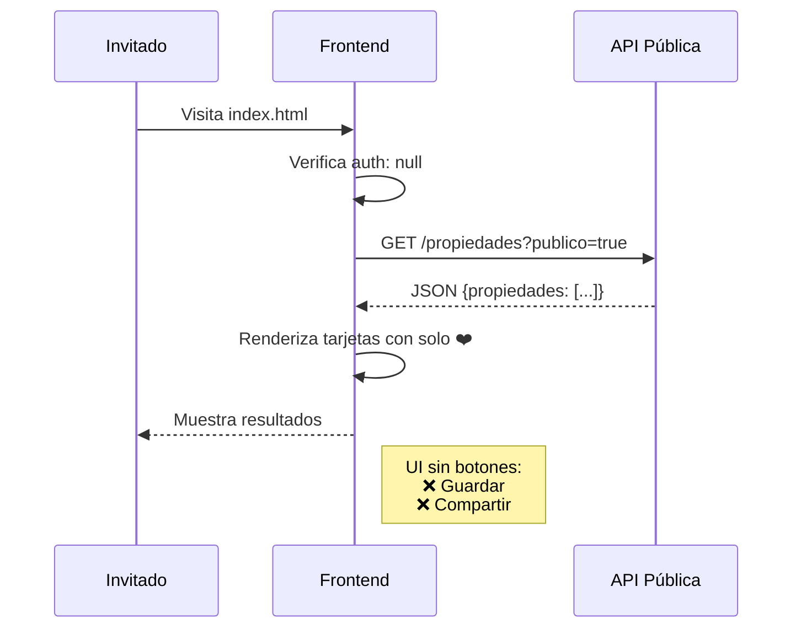
```mermaid
sequenceDiagram
    participant U as Invitado
    participant F as Frontend
    participant API as API Pública

    U->>F: Visita index.html
    F->>F: Verifica auth: null
    F->>API: GET /propiedades?publico=true
    API-->>F: JSON {propiedades: [...]}
    F->>F: Renderiza tarjetas con solo ❤️
    F-->>U: Muestra resultados
    Note right of F: UI sin botones:<br/>❌ Guardar<br/>❌ Compartir
```

#### **1.2 Intento de Favorito → Conversión**

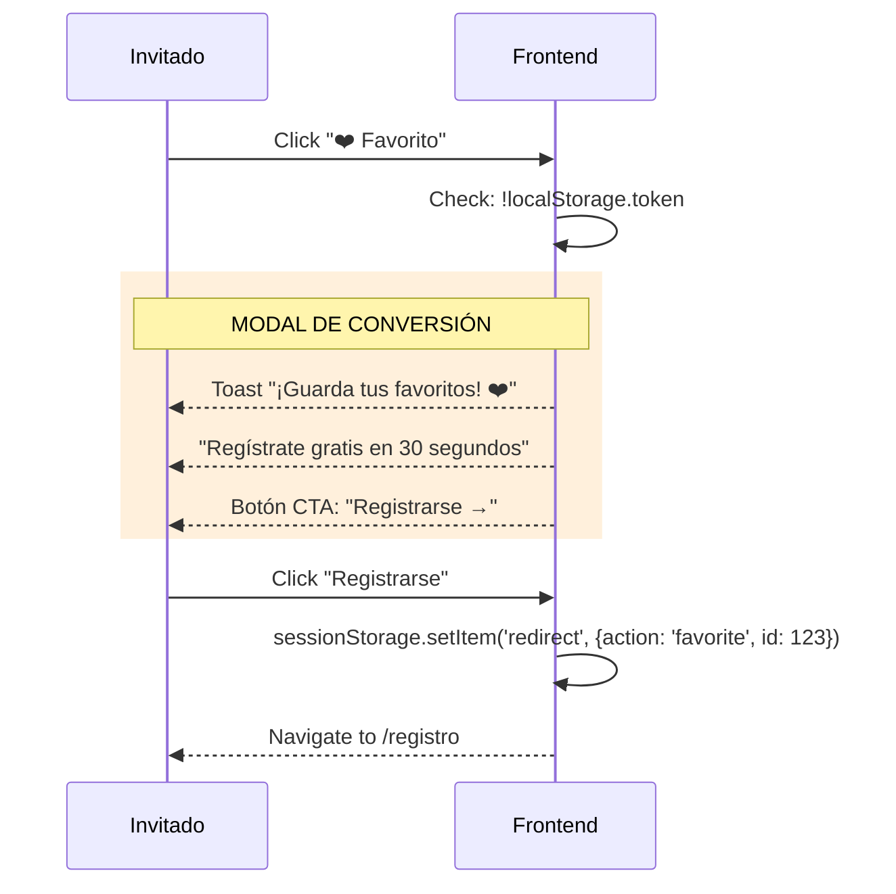
```mermaid
sequenceDiagram
    participant U as Invitado
    participant F as Frontend
    
    U->>F: Click "❤️ Favorito"
    F->>F: Check: !localStorage.token
    rect rgb(255, 240, 220)
        Note over U,F: MODAL DE CONVERSIÓN
        F-->>U: Toast "¡Guarda tus favoritos! ❤️"
        F-->>U: "Regístrate gratis en 30 segundos"
        F-->>U: Botón CTA: "Registrarse →"
    end
    U->>F: Click "Registrarse"
    F->>F: sessionStorage.setItem('redirect', {action: 'favorite', id: 123})
    F-->>U: Navigate to /registro
```

### **Perfil 1: Demandante (Buscador)**
```
Dashboard
  ├── KPIs: Total búsquedas, favoritos, tipos de interés, distritos
  └── Gráficos: Búsquedas por distrito, favoritos por distrito

Búsquedas
  ├── Ver historial de búsquedas guardadas
  └── Repetir búsquedas anteriores

Favoritos
  ├── Ver inmuebles favoritos
  └── Eliminar favoritos

Subscripciones
  ├── Notificaciones de nuevos inmuebles
  └── Alertas de cambios de precio
```

**Interfaz Usuario Registrado (Demandante):**
```
Resultados de Búsqueda:
  ├── Tarjeta Propiedad
  │   ├── ✅ Imagen
  │   ├── ✅ Título
  │   ├── ✅ Precio
  │   └── ✅ Botón "❤️ Favorito" (funcional - guarda/quita favorito)
  │
  ├── ✅ Botón "💾 GUARDAR" (guarda búsqueda actual)
  └── ✅ Botón "📧 COMPARTIR" (comparte búsqueda por correo)
```

### 📊 **Diagramas Demandante**

#### **2.1 Registro Inmediato (Perfil 1)**

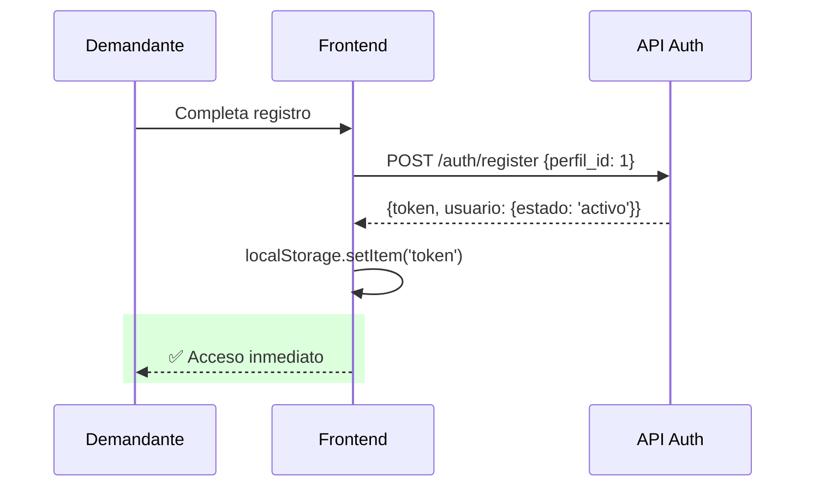
```mermaid
sequenceDiagram
    participant D as Demandante
    participant F as Frontend
    participant Auth as API Auth

    D->>F: Completa registro
    F->>Auth: POST /auth/register {perfil_id: 1}
    Auth-->>F: {token, usuario: {estado: 'activo'}}
    F->>F: localStorage.setItem('token')
    rect rgb(220, 255, 220)
        F-->>D: ✅ Acceso inmediato
    end
```

#### **2.2 Búsqueda Autenticada con Tracking**

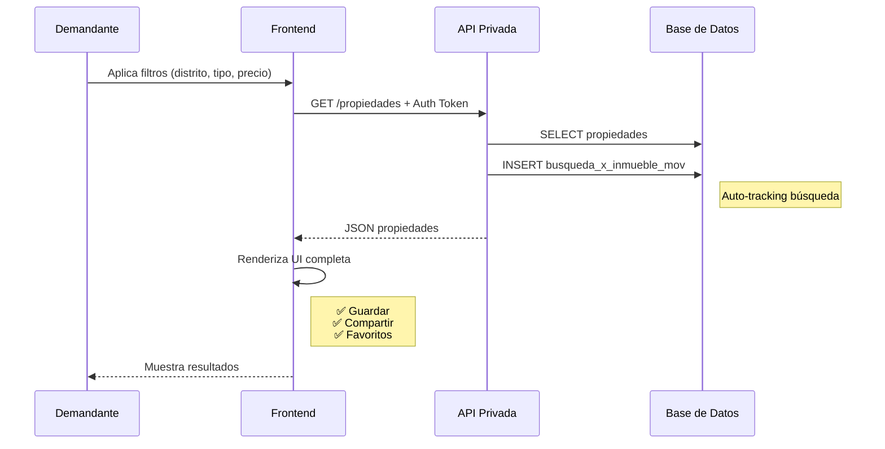
```mermaid
sequenceDiagram
    participant D as Demandante
    participant F as Frontend
    participant API as API Privada
    participant BD as Base de Datos

    D->>F: Aplica filtros (distrito, tipo, precio)
    F->>API: GET /propiedades + Auth Token
    API->>BD: SELECT propiedades
    API->>BD: INSERT busqueda_x_inmueble_mov
    Note right of BD: Auto-tracking búsqueda
    API-->>F: JSON propiedades
    F->>F: Renderiza UI completa
    Note right of F: ✅ Guardar<br/>✅ Compartir<br/>✅ Favoritos
    F-->>D: Muestra resultados
```

#### **2.3 Guardar Búsqueda para Alertas**

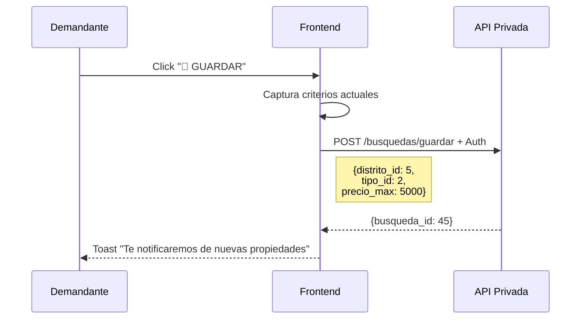
```mermaid
sequenceDiagram
    participant D as Demandante
    participant F as Frontend
    participant API as API Privada

    D->>F: Click "💾 GUARDAR"
    F->>F: Captura criterios actuales
    F->>API: POST /busquedas/guardar + Auth
    Note right of F: {distrito_id: 5,<br/>tipo_id: 2,<br/>precio_max: 5000}
    API-->>F: {busqueda_id: 45}
    F-->>D: Toast "Te notificaremos de nuevas propiedades"
```

#### **2.4 Toggle Favorito**

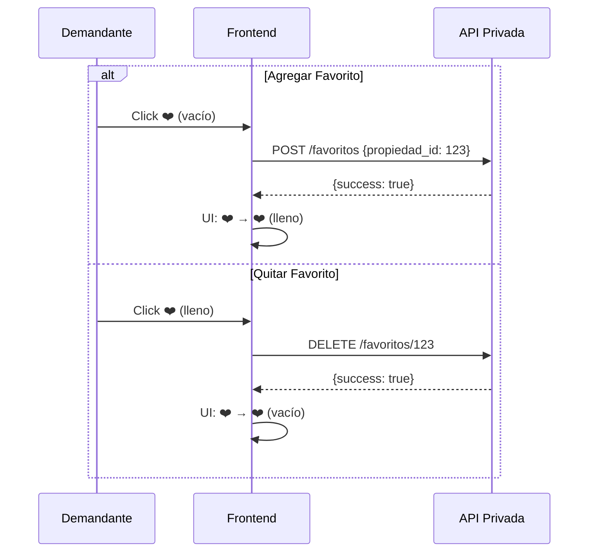
```mermaid
sequenceDiagram
    participant D as Demandante
    participant F as Frontend
    participant API as API Privada

    alt Agregar Favorito
        D->>F: Click ❤️ (vacío)
        F->>API: POST /favoritos {propiedad_id: 123}
        API-->>F: {success: true}
        F->>F: UI: ❤️ → ❤️ (lleno)
    else Quitar Favorito
        D->>F: Click ❤️ (lleno)
        F->>API: DELETE /favoritos/123
        API-->>F: {success: true}
        F->>F: UI: ❤️ → ❤️ (vacío)
    end
```

#### **2.5 Dashboard Personal**

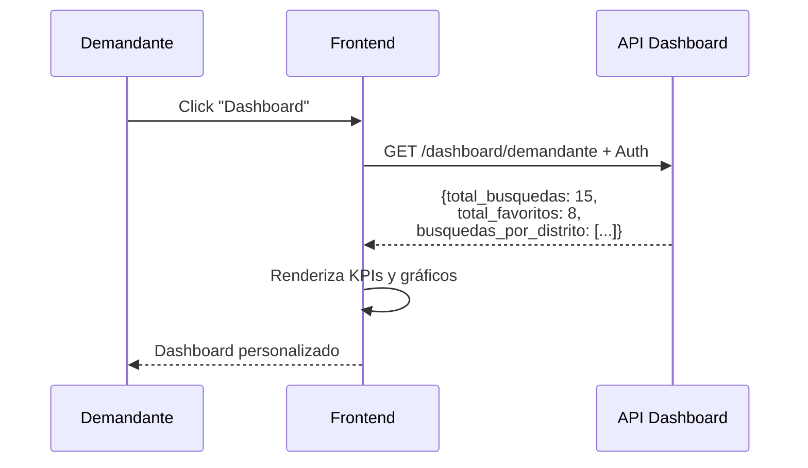
```mermaid
sequenceDiagram
    participant D as Demandante
    participant F as Frontend
    participant API as API Dashboard

    D->>F: Click "Dashboard"
    F->>API: GET /dashboard/demandante + Auth
    API-->>F: {total_busquedas: 15,<br/>total_favoritos: 8,<br/>busquedas_por_distrito: [...]}
    F->>F: Renderiza KPIs y gráficos
    F-->>D: Dashboard personalizado
```

### **Perfil 2: Ofertante (Propietario)**
```
⚠️ REQUIERE APROBACIÓN ADMIN

Dashboard
  ├── KPIs: Total propiedades, activas, valor cartera
  └── Gráficos: Propiedades por tipo, por estado

Propiedades
  ├── ✅ Registrar: Inmuebles propios
  ├── ✅ Editar: Modificar datos
  ├── ✅ Pausar/Cerrar: Cambiar estado
  └── ✅ Ver: Tracking CRM

Búsquedas, Favoritos, Subscripciones (igual que Demandante)
```

### 📊 **Diagramas Ofertante**

#### **3.1 Registro con Aprobación Pendiente**

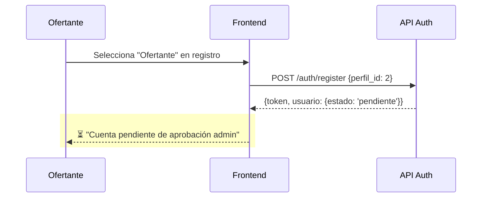
```mermaid
sequenceDiagram
    participant O as Ofertante
    participant F as Frontend
    participant Auth as API Auth

    O->>F: Selecciona "Ofertante" en registro
    F->>Auth: POST /auth/register {perfil_id: 2}
    Auth-->>F: {token, usuario: {estado: 'pendiente'}}
    rect rgb(255, 255, 200)
        F-->>O: ⏳ "Cuenta pendiente de aprobación admin"
    end
```

#### **3.2 Aprobación por Admin**

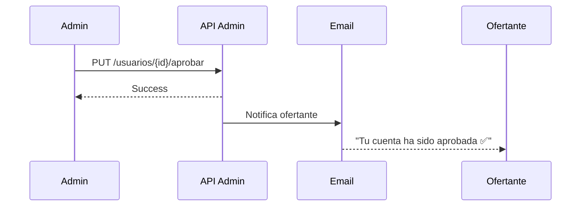
```mermaid
sequenceDiagram
    participant Admin as Admin
    participant API as API Admin
    participant Email as Email
    participant O as Ofertante

    Admin->>API: PUT /usuarios/{id}/aprobar
    API-->>Admin: Success
    API->>Email: Notifica ofertante
    Email-->>O: "Tu cuenta ha sido aprobada ✅"
```

#### **3.3 Registrar Primera Propiedad**

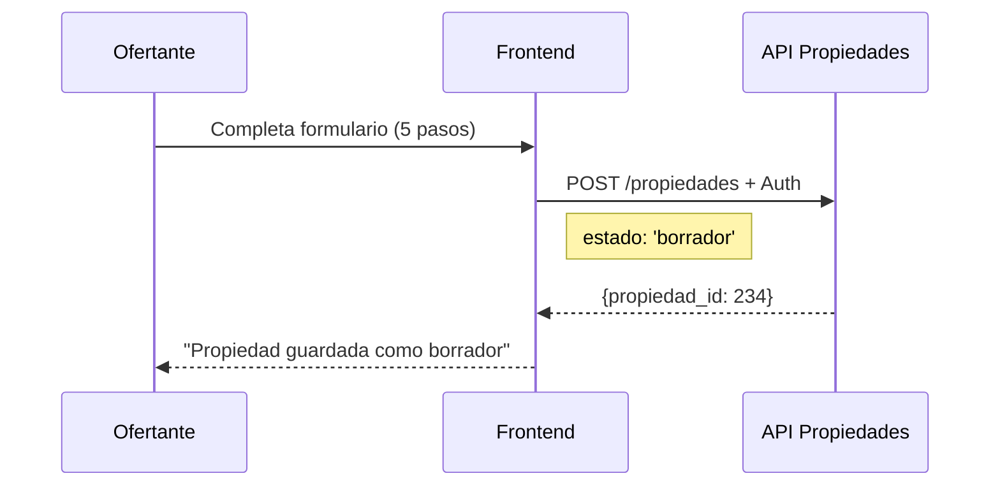
```mermaid
sequenceDiagram
    participant O as Ofertante
    participant F as Frontend
    participant API as API Propiedades

    O->>F: Completa formulario (5 pasos)
    F->>API: POST /propiedades + Auth
    Note right of F: estado: 'borrador'
    API-->>F: {propiedad_id: 234}
    F-->>O: "Propiedad guardada como borrador"
```

#### **3.4 Flujo de Revisión y Publicación**

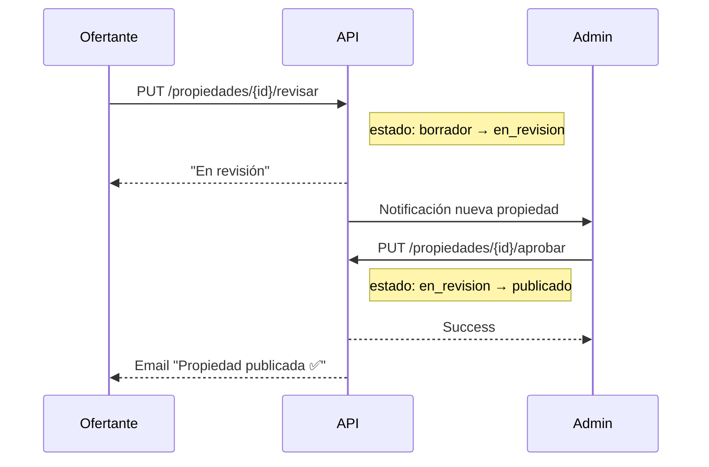
```mermaid
sequenceDiagram
    participant O as Ofertante
    participant API as API
    participant Admin as Admin

    O->>API: PUT /propiedades/{id}/revisar
    Note right of API: estado: borrador → en_revision
    API-->>O: "En revisión"
    API->>Admin: Notificación nueva propiedad
    
    Admin->>API: PUT /propiedades/{id}/aprobar
    Note right of API: estado: en_revision → publicado
    API-->>Admin: Success
    API-->>O: Email "Propiedad publicada ✅"
```

### **Perfil 3: Corredor (Intermediario)**
```
⚠️ REQUIERE APROBACIÓN ADMIN
⚠️ MANEJA COMISIONES

Dashboard
  ├── KPIs: Propiedades en cartera, activas, valor total, favoritos
  └── Gráficos: Propiedades por tipo, búsquedas, favoritos por distrito

Propiedades
  ├── ✅ Registrar: Inmuebles de terceros (con datos propietario)
  ├── ✅ Comisión: Configurar comision_corredor
  ├── ✅ Asignación: corredor_asignado_id (puede ser él mismo)
  └── ✅ Ver: Tracking completo CRM

Búsquedas, Favoritos, Subscripciones (igual que Demandante)
```

### 📊 **Diagramas Corredor**

#### **4.1 Registro Corredor con Datos Profesionales**

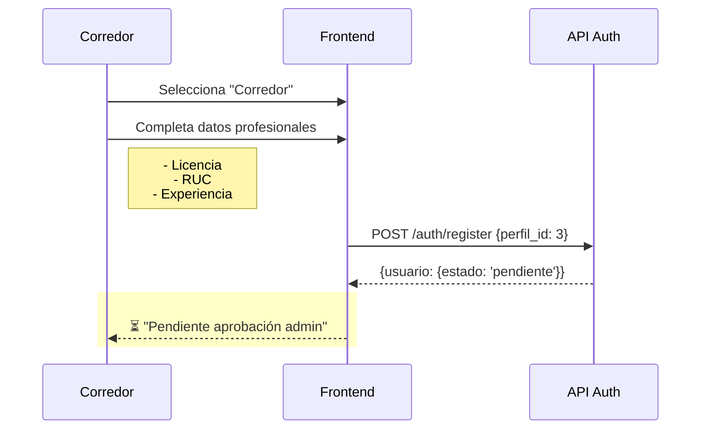
```mermaid
sequenceDiagram
    participant C as Corredor
    participant F as Frontend
    participant Auth as API Auth

    C->>F: Selecciona "Corredor"
    C->>F: Completa datos profesionales
    Note right of C: - Licencia<br/>- RUC<br/>- Experiencia
    F->>Auth: POST /auth/register {perfil_id: 3}
    Auth-->>F: {usuario: {estado: 'pendiente'}}
    rect rgb(255, 255, 200)
        F-->>C: ⏳ "Pendiente aprobación admin"
    end
```

#### **4.2 Registrar Propiedad de Tercero**

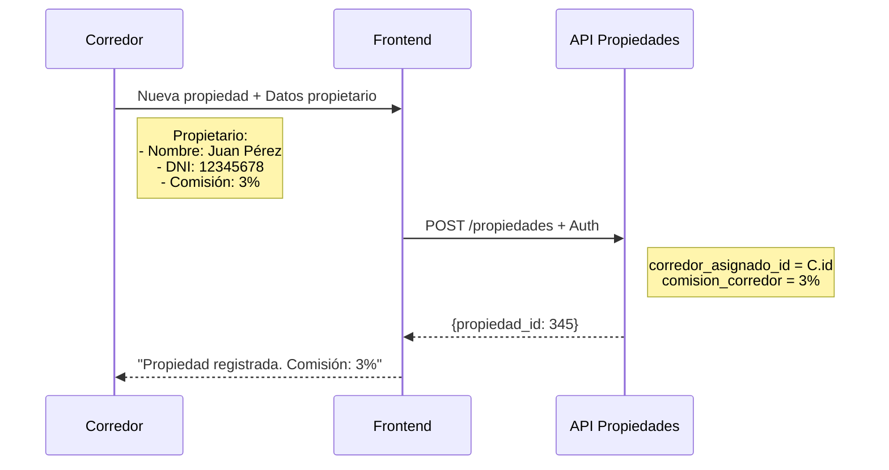
```mermaid
sequenceDiagram
    participant C as Corredor
    participant F as Frontend
    participant API as API Propiedades

    C->>F: Nueva propiedad + Datos propietario
    Note right of C: Propietario:<br/>- Nombre: Juan Pérez<br/>- DNI: 12345678<br/>- Comisión: 3%
    F->>API: POST /propiedades + Auth
    Note right of API: corredor_asignado_id = C.id<br/>comision_corredor = 3%
    API-->>F: {propiedad_id: 345}
    F-->>C: "Propiedad registrada. Comisión: 3%"
```

#### **4.3 Pipeline CRM - Estados**

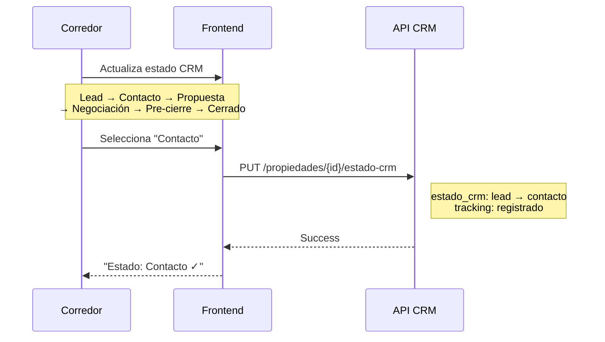
```mermaid
sequenceDiagram
    participant C as Corredor
    participant F as Frontend
    participant API as API CRM

    C->>F: Actualiza estado CRM
    Note over C,F: Lead → Contacto → Propuesta<br/>→ Negociación → Pre-cierre → Cerrado
    
    C->>F: Selecciona "Contacto"
    F->>API: PUT /propiedades/{id}/estado-crm
    Note right of API: estado_crm: lead → contacto<br/>tracking: registrado
    API-->>F: Success
    F-->>C: "Estado: Contacto ✓"
```

#### **4.4 Negociación de Precio**

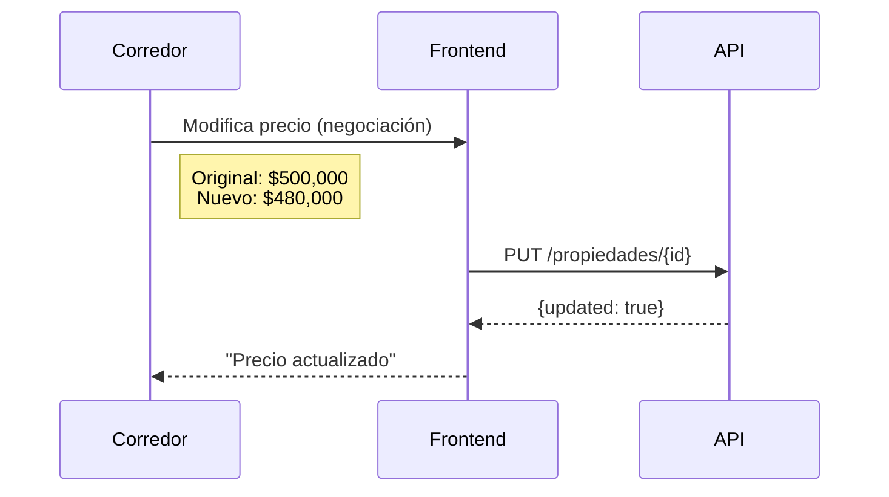
```mermaid
sequenceDiagram
    participant C as Corredor
    participant F as Frontend
    participant API as API

    C->>F: Modifica precio (negociación)
    Note right of C: Original: $500,000<br/>Nuevo: $480,000
    F->>API: PUT /propiedades/{id}
    API-->>F: {updated: true}
    F-->>C: "Precio actualizado"
```

#### **4.5 Cierre de Venta y Comisión**

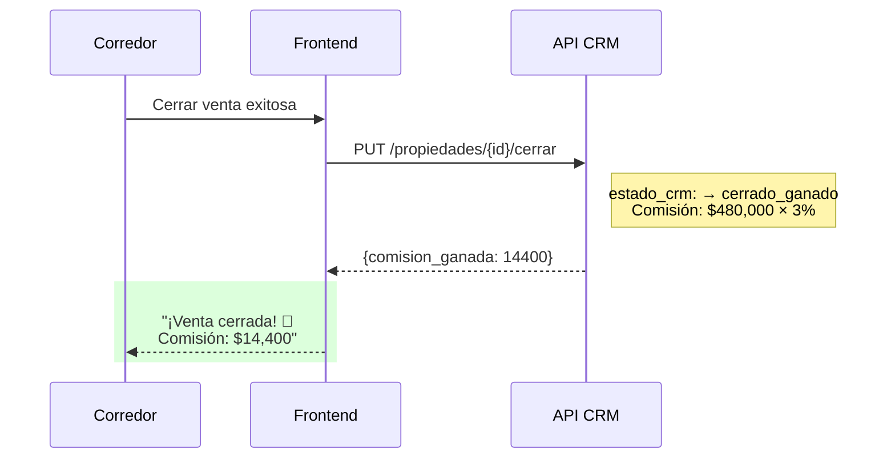
```mermaid
sequenceDiagram
    participant C as Corredor
    participant F as Frontend
    participant API as API CRM

    C->>F: Cerrar venta exitosa
    F->>API: PUT /propiedades/{id}/cerrar
    Note right of API: estado_crm: → cerrado_ganado<br/>Comisión: $480,000 × 3%
    API-->>F: {comision_ganada: 14400}
    rect rgb(220, 255, 220)
        F-->>C: "¡Venta cerrada! 🎉<br/>Comisión: $14,400"
    end
```

#### **4.6 Dashboard Corredor con Pipeline**

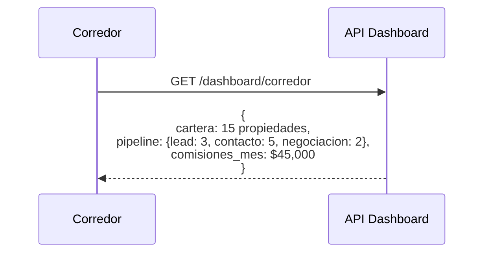
```mermaid
sequenceDiagram
    participant C as Corredor
    participant API as API Dashboard

    C->>API: GET /dashboard/corredor
    API-->>C: {<br/>  cartera: 15 propiedades,<br/>  pipeline: {lead: 3, contacto: 5, negociacion: 2},<br/>  comisiones_mes: $45,000<br/>}
```

### **Perfil 4: Administrador**
```
Dashboard
  ├── KPIs: Total propiedades, búsquedas, sin corredor, valor cartera
  ├── Pipeline CRM: Estados de todas las propiedades
  └── Asignación Corredores: Con/Sin asignar

Propiedades
  ├── ✅ Ver: Todas las propiedades
  ├── ✅ Verificar: Documentos, aprobar/rechazar
  └── ✅ Asignar: Corredor a propiedades

Aprobaciones
  ├── ✅ Aprobar: Usuarios Ofertante/Corredor
  ├── ✅ Aprobar: Publicación de propiedades
  └── ✅ Rechazar: Con motivo_rechazo

Mantenimientos
  ├── ✅ Configurar: Tipos inmuebles, categorías, características
  ├── ✅ Configurar: Estados CRM
  └── ✅ Gestionar: Distritos, zonas

Reportes
  ├── Propiedades por estado
  ├── Comisiones por corredor
  └── Actividad del sistema
```

### 📊 **Diagramas Administrador**

#### **5.1 Aprobar Usuarios (Ofertante/Corredor)**

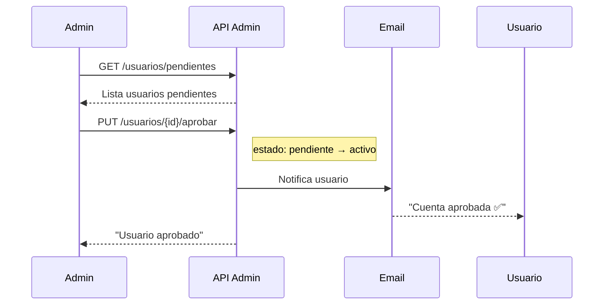
```mermaid
sequenceDiagram
    participant A as Admin
    participant API as API Admin
    participant Email as Email
    participant U as Usuario

    A->>API: GET /usuarios/pendientes
    API-->>A: Lista usuarios pendientes
    A->>API: PUT /usuarios/{id}/aprobar
    Note right of API: estado: pendiente → activo
    API->>Email: Notifica usuario
    Email-->>U: "Cuenta aprobada ✅"
    API-->>A: "Usuario aprobado"
```

#### **5.2 Aprobar/Rechazar Propiedades**

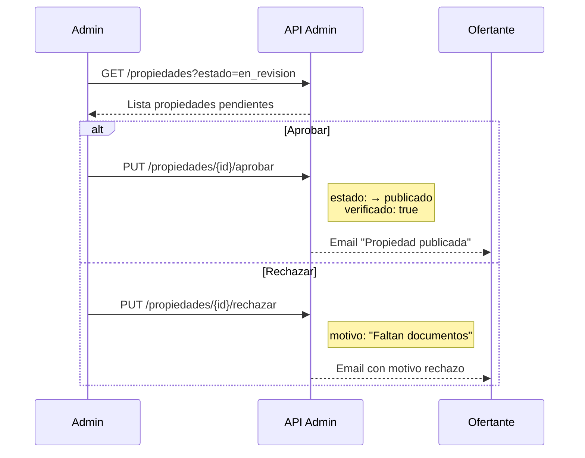
```mermaid
sequenceDiagram
    participant A as Admin
    participant API as API Admin
    participant O as Ofertante

    A->>API: GET /propiedades?estado=en_revision
    API-->>A: Lista propiedades pendientes
    
    alt Aprobar
        A->>API: PUT /propiedades/{id}/aprobar
        Note right of API: estado: → publicado<br/>verificado: true
        API-->>O: Email "Propiedad publicada"
    else Rechazar
        A->>API: PUT /propiedades/{id}/rechazar
        Note right of API: motivo: "Faltan documentos"
        API-->>O: Email con motivo rechazo
    end
```

#### **5.3 Asignar Corredor a Propiedad**

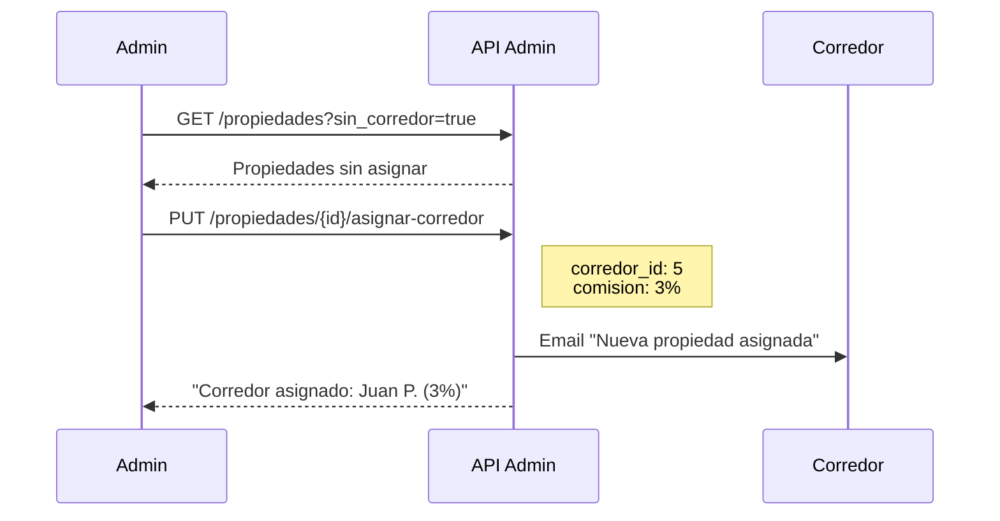
```mermaid
sequenceDiagram
    participant A as Admin
    participant API as API Admin
    participant C as Corredor

    A->>API: GET /propiedades?sin_corredor=true
    API-->>A: Propiedades sin asignar
    A->>API: PUT /propiedades/{id}/asignar-corredor
    Note right of API: corredor_id: 5<br/>comision: 3%
    API->>C: Email "Nueva propiedad asignada"
    API-->>A: "Corredor asignado: Juan P. (3%)"
```

#### **5.4 Configurar Características Dinámicas**

```mermaid
sequenceDiagram
    participant A as Admin
    participant API as API Config

    A->>API: GET /caracteristicas
    API-->>A: Lista actual
    A->>API: POST /caracteristicas
    Note right of API: {<br/>  categoria: "Ubicación",<br/>  nombre: "Cerca al Metro",<br/>  tipo: "checkbox"<br/>}
    API-->>A: "Característica agregada"
```

#### **5.5 Dashboard Global Admin**

```mermaid
sequenceDiagram
    participant A as Admin
    participant API as API Dashboard

    A->>API: GET /dashboard/admin
    API-->>A: {<br/>  total_propiedades: 450,<br/>  sin_corredor: 12 ⚠️,<br/>  usuarios_pendientes: 3,<br/>  pipeline_crm: {...},<br/>  valor_cartera: $15M<br/>}
    Note over A: Muestra KPIs y alertas
```

---

## ⚙️ **MODELO DE DATOS DINÁMICO**

### **Configuración de Tipos e Inmuebles**

```
tipo_inmueble_mae
  ├── id: 1, nombre: "Edificio Completo", padre_id: NULL
  ├── id: 2, nombre: "Oficina en Edificio", padre_id: 1 (⚠️ LLAVE RECURSIVA)
  ├── id: 3, nombre: "Casa", padre_id: NULL
  └── id: 4, nombre: "Casa en Condominio", padre_id: 3 (⚠️ LLAVE RECURSIVA)
```

**Regla**: Para registrar "Oficina en Edificio", primero debe existir el "Edificio Completo" padre.

### **Categorías por Tipo**

```
categorias_mae
  ├── tipo_inmueble_id: 1 (Edificio Completo)
  │     ├── nombre: "Ubicación"
  │     ├── nombre: "Estructura"
  │     └── nombre: "Servicios"
  └── tipo_inmueble_id: 2 (Oficina en Edificio)
        ├── nombre: "Características Oficina"
        └── nombre: "Acabados"
```

### **Características por Categoría**

```
caracteristicas_mae
  ├── categoria_id: 1 (Ubicación)
  │     ├── nombre: "Zona Comercial", tipo: "checkbox"
  │     └── nombre: "Cerca a Metro", tipo: "checkbox"
  ├── categoria_id: 2 (Estructura)
  │     ├── nombre: "Número de Pisos", tipo: "number"
  │     └── nombre: "Año Construcción", tipo: "number"
  └── categoria_id: 3 (Servicios)
        ├── nombre: "Ascensores", tipo: "number"
        └── nombre: "Estacionamientos", tipo: "number"
```

### **Asignación a Inmuebles**

```
caracteristicas_x_inmueble_mae
  ├── registro_cab_id: 123
  ├── caracteristica_id: 5
  └── valor: "10" (10 ascensores)
```

**Ventaja**: Configuración dinámica sin alterar esquema de BD.

---

## 📊 **PIPELINE CRM INMOBILIARIO**

### **Estados CRM (estado_crm)**

```sql
estados_crm_mae
  ├── 'lead'              -- Primer contacto, propiedad recién ingresada
  ├── 'contacto'          -- Se contactó al propietario/interesado
  ├── 'propuesta'         -- Se envió propuesta comercial
  ├── 'negociacion'       -- En proceso de negociación
  ├── 'pre_cierre'        -- Documentos en revisión, cerca de cerrar
  ├── 'cerrado_ganado'    -- ✅ Transacción exitosa
  └── 'cerrado_perdido'   -- ❌ No se concretó
```

### **Estados de Publicación (estado)**

```sql
'borrador'    -- Aún no publicado (editable por usuario)
'publicado'   -- Visible en búsquedas públicas
'pausado'     -- Temporalmente oculto (puede reactivarse)
'cerrado'     -- Transacción completada
'rechazado'   -- Admin rechazó (motivo_rechazo)
```

### **Tracking de Cambios**

```sql
registro_x_inmueble_tracking
  ├── registro_cab_id
  ├── estado_anterior
  ├── estado_nuevo
  ├── usuario_id (quién hizo el cambio)
  ├── fecha_cambio
  └── observaciones
```

**Objetivo**: Auditoría completa de todos los cambios de estado.

---

## 🔐 **REGLAS DE NEGOCIO CRÍTICAS**

### **1. Registro de Usuarios**

```
Al Registrarse:
  ├── Opción 1: Demandante → ✅ Acceso inmediato
  ├── Opción 2: Ofertante → ⚠️ Requiere aprobación Admin
  └── Opción 3: Corredor → ⚠️ Requiere aprobación Admin
```

**Implementación Pendiente**: Combo de selección de perfil en registro.

### **2. Asignación de Corredores**

```
Al Registrar Propiedad:
  ├── Si usuario = Ofertante
  │     ├── corredor_asignado_id = NULL (sin asignar)
  │     └── Admin debe asignar corredor manualmente
  └── Si usuario = Corredor
        ├── corredor_asignado_id = self (él mismo)
        └── comision_corredor = X% (configurable)
```

### **3. Jerarquía de Tipos**

```
Para Registrar "Oficina en Edificio":
  ├── DEBE existir registro padre: "Edificio Completo"
  ├── Datos en común: direccion, distrito (del padre)
  └── Datos propios: area_oficina, piso, numero_oficina
```

**Ejemplo**:
1. Registrar: Edificio "Torre Empresarial" (id: 100)
2. Registrar: Oficina 301 → padre_id: 100

### **4. Favoritos Solo para Registrados**

```
Usuario Invitado → Click Favorito:
  └── Mostrar Toast: 
      "Esta funcionalidad solo está disponible si te registras. 
       ¡Regístrate gratis para guardar favoritos y búsquedas!"
```

---

## 🔄 **FLUJOS DE REGISTRO Y APROBACIÓN**

### **Flujo 1: Usuario Demandante**

```
1. Registro → Perfil: Demandante
2. ✅ Acceso inmediato
3. Dashboard muestra:
   - Búsquedas realizadas
   - Favoritos guardados
   - Subscripciones activas
```

### **Flujo 2: Usuario Ofertante**

```
1. Registro → Perfil: Ofertante
2. ⏳ Estado: Pendiente aprobación
3. Admin recibe notificación
4. Admin aprueba/rechaza
5. Si aprobado:
   ✅ Puede registrar propiedades
   ✅ Dashboard muestra sus propiedades
6. Si rechazado:
   ❌ Solo tiene acceso como Demandante
```

### **Flujo 3: Usuario Corredor**

```
1. Registro → Perfil: Corredor
2. ⏳ Estado: Pendiente aprobación
3. Admin recibe notificación
4. Admin aprueba/rechaza
5. Si aprobado:
   ✅ Puede registrar propiedades de terceros
   ✅ Puede asignarse a sí mismo
   ✅ Puede configurar comisiones
   ✅ Dashboard muestra cartera completa
6. Si rechazado:
   ❌ Solo tiene acceso como Demandante
```

### **Flujo 4: Aprobación de Propiedades**

```
1. Ofertante/Corredor registra propiedad
2. estado = 'borrador'
3. Usuario envía a revisión
4. Admin verifica:
   - Documentos (documentos_verificados)
   - Datos completos
   - Fotos adecuadas
5. Admin decide:
   ├── Aprobar → estado = 'publicado'
   │     ├── verificado_por = admin_id
   │     └── verificado_at = NOW()
   └── Rechazar → estado = 'rechazado'
         └── motivo_rechazo = "Faltan documentos de propiedad"
```

---

## 📈 **SISTEMA DE TRACKING**

### **¿Qué se Trackea?**

```sql
registro_x_inmueble_tracking
  ├── Cambios de estado CRM (lead → contacto → propuesta...)
  ├── Cambios de estado publicación (borrador → publicado)
  ├── Asignación de corredor
  ├── Cambios de precio
  ├── Aprobaciones/Rechazos
  └── Cualquier modificación importante
```

### **Ejemplo de Tracking**

```
Propiedad ID: 123 "Oficina en San Isidro"

Tracking:
  1. 2024-01-15 10:00 | estado: NULL → 'borrador' | Usuario: Corredor#5
  2. 2024-01-15 10:30 | corredor_asignado: NULL → Corredor#5 | Usuario: Corredor#5
  3. 2024-01-16 09:00 | estado: 'borrador' → 'publicado' | Usuario: Admin#1
  4. 2024-01-16 09:00 | verificado: false → true | Usuario: Admin#1
  5. 2024-01-20 14:00 | estado_crm: 'lead' → 'contacto' | Usuario: Corredor#5
  6. 2024-01-25 16:00 | estado_crm: 'contacto' → 'propuesta' | Usuario: Corredor#5
  7. 2024-02-01 11:00 | precio_venta: 500000 → 480000 | Usuario: Corredor#5
  8. 2024-02-10 10:00 | estado_crm: 'propuesta' → 'cerrado_ganado' | Usuario: Corredor#5
```

---

## ⚠️ **OPORTUNIDADES DE MEJORA**

### **1. Normalizar Datos de Propietario**

**Problema Actual**:
```sql
registro_x_inmueble_cab tiene:
  - propietario_real_nombre
  - propietario_real_dni
  - propietario_real_telefono
  - propietario_real_email
```

**Propuesta**:
```sql
-- Nueva tabla
propietarios
  ├── propietario_id (PK)
  ├── dni (UNIQUE)
  ├── nombre
  ├── telefono
  ├── email
  └── created_at

-- Modificar
registro_x_inmueble_cab
  ├── propietario_id (FK) ← Solo referencia
  └── (remover campos duplicados)
```

**Ventajas**:
- ✅ Evita duplicados (mismo propietario con múltiples inmuebles)
- ✅ Actualización centralizada
- ✅ Historial de propiedades por propietario

### **2. Mejorar Nomenclatura CRM**

**Problema**: "Pipeline" confunde en contexto inmobiliario

**Propuesta**:
- `estados_crm_mae` → `etapas_negociacion_mae`
- `estado_crm` → `etapa_negociacion`

### **3. Separar Imágenes**

**Problema Actual**:
```sql
registro_x_inmueble_cab
  ├── imagen_principal (varchar 500)
  └── imagenes (text array)
```

**Propuesta**:
```sql
-- Nueva tabla
inmueble_imagenes
  ├── imagen_id (PK)
  ├── registro_cab_id (FK)
  ├── url
  ├── es_principal (boolean)
  ├── orden
  └── created_at
```

---

## 🚀 **APIS DISPONIBLES**

**Backend**: https://appbackimmobiliaria-production.up.railway.app/docs

**Progreso**: 80% avanzado

### **APIs Públicas (Sin Auth)**
- `GET /api/v1/propiedades` - Buscar inmuebles
- `GET /api/v1/propiedades/{id}` - Detalle inmueble
- `POST /api/v1/propiedades/compartir` - Enviar ficha por correo

### **APIs Privadas (Con Auth)**
- `POST /api/v1/auth/register` - Registro
- `POST /api/v1/auth/login` - Login
- `GET /api/v1/perfiles/me` - Perfil actual
- `POST /api/v1/propiedades` - Registrar inmueble
- `PUT /api/v1/propiedades/{id}` - Actualizar inmueble
- `POST /api/v1/favoritos` - Guardar favorito
- `POST /api/v1/busquedas` - Guardar búsqueda

---

## 🎯 **HOJA DE RUTA**

### **Fase 1: Completar Registro** ✅ En Progreso
- [ ] Agregar combo selección perfil en registro
- [ ] Implementar aprobación admin para Ofertante/Corredor
- [ ] Notificaciones de aprobación/rechazo

### **Fase 2: Tracking CRM** 🔄 Pendiente
- [ ] Implementar registro automático en `registro_x_inmueble_tracking`
- [ ] Dashboard de tracking para corredores
- [ ] Reportes de actividad CRM

### **Fase 3: Optimizaciones** 📋 Planificado
- [ ] Normalizar tabla propietarios
- [ ] Separar tabla de imágenes
- [ ] Mejorar nomenclatura CRM

### **Fase 4: Features Avanzadas** 🚀 Futuro
- [ ] Notificaciones push
- [ ] Chat en tiempo real
- [ ] Reportes analíticos

---

## 📞 **SOPORTE Y CONTACTO**

- **Backend API**: https://appbackimmobiliaria-production.up.railway.app/docs
- **Frontend**: En desarrollo
- **Arquitecto**: Alan Cairampoma

---

**🏢 CUADRANTE - Regulando el Futuro Inmobiliario**

*"La herramienta única en el mercado para corredores y ofertantes"*
